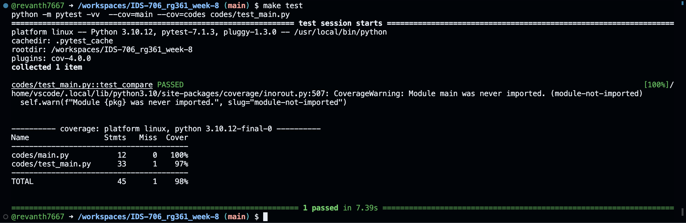
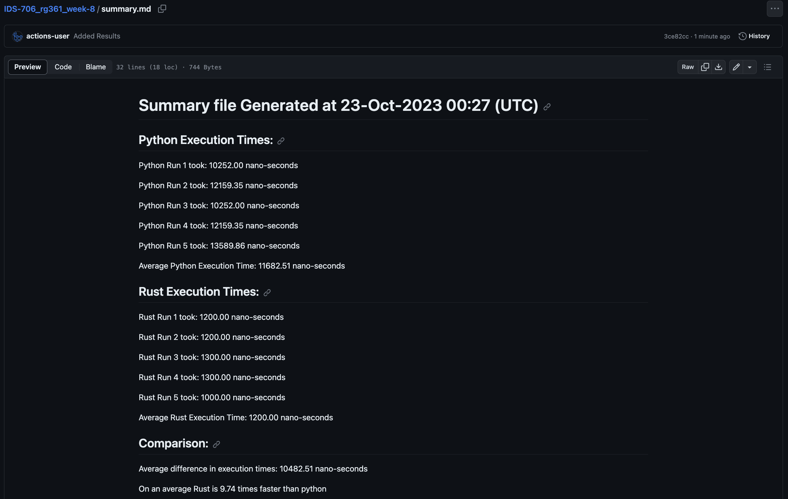
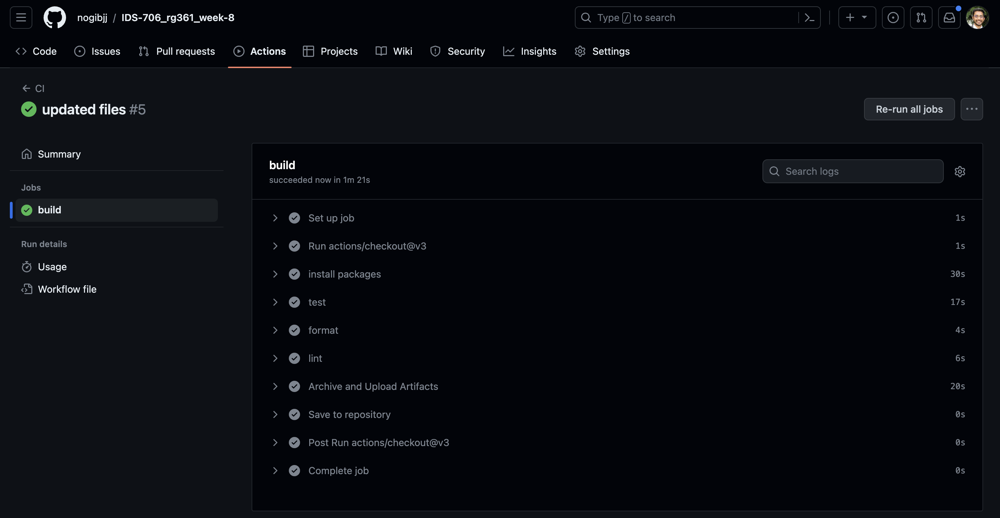

# Performance Comparison Between Python and Rust

[](https://github.com/nogibjj/IDS-706_rg361_week-8/actions/workflows/cicd.yml)

This repositroy contains files to compare the performance of ``Python`` and ``Rust``.

On an average, Rust was found to be ``~5-10`` times faster than python for the given scenario.

The comparisons are logged automatically in the ``summary.md`` file for easy access.


Created on 22-Oct-2023

## Overview

The repository has the ``main.py`` and ``main.rs`` files in the codes directory which perform the same operation.

The codes print the amount of time they take to calculate the factorial of 31 using iterative process.

The ``test_main`` code is used to call the main files multiple times and calcuates the average execution times.

The file logs these comparisons in the ``summary.md`` file for future referece.

``Github`` actions automatically runs the ``test_main.py`` which triggers the comparison whenever there is an update in the repository.


## Instructions

Create a Codespace on main which will initialize the enviroment with the required packages and settings to execute the codes.

The files can be executed individually or via the ``test_main`` file.

To Execute Python Version:
```console
python ./codes/main.py
```

To Execute Rust Version:
```console
cargo run --manifest-path ./codes/Cargo.toml
```

**Note**: The '.codes/' can be ommited if the programs are being executed from the codes directory


## Sample Execution and Test

**Testing:** "make test" command is run to trigger the performace comparison.



  **Sample Output:** the test file calls the main functions 5 times and calcualtes the average performances, Rust is found to be ~9 times faster that Python:

   


## Contents

### 1. summary.md
  contains the performace comparison summary between Python and Rust, it is automatically updated whenever test_main.py file is used. 

### 2. README.md
   contains the information about the repository and instructions for using it
   
### 3. requirements.txt
   contains the list of packages and libraries which are required for running the project. These are intalled and used in the virtual environment and Github actions.
   
### 4. .github/workflows
   github actions are used to automate the following processes whenever a change is made to the files in the repository:
   - ``install`` : installs the packages and libraries mentioned in the requirements.txt
   - ``test`` : uses ``pytest`` to trigger the test_main.py file
      
      **Note:** this action automatically triggers the comparison operations whenever any changes are made in the repository
     
   - ``format`` : uses ``black`` to format the python files and ``rustfmt`` to format Rust files
   - ``lint`` : uses ``ruff`` to lint the python files and ``clippy`` to lint Rust files
   
     
   **Note** -if all the processes run successfully the following output will be visible in github actions:
   
   
### 5. Makefile
   contains the instructions and sequences for the processes used in github actions and .devcontainer for creating the virtual environment
   
### 6. .devcontainer
   contains the ``dockerfile`` and ``devcontainer.json`` files which are used to build and define the setting of the virtual environment (codespaces - python) for running the codes.
   
### 7. setup.sh
  contains the terminal commands to install and setup Rust.
  
### 8. resources 
   contains additonal files which are used in the README


  
